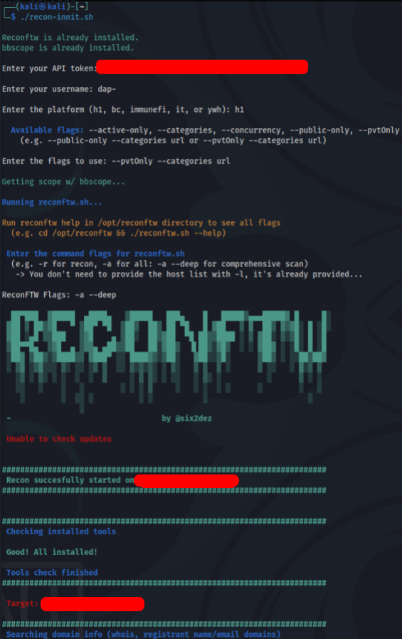

# bbautorecon

This is a Bash script that automates the reconnaissance process for bug bounty hunters and security researchers. The script first uses the bbscope tool to gather data from various bug bounty platforms, and then uses reconftw to perform reconnaissance on the discovered targets.

## Requirements

    - bbscope tool (installed via GO111MODULE=on go install github.com/sw33tLie/bbscope@latest)
    - reconftw tool (installed automatically if not found in /opt/reconftw)
    - API token from a bug bounty platform (e.g. HackerOne)

## Install 

```bash
cd /opt
git clone https://github.com/literallynotdap/bbautorecon
cd bbautorecon
# run bbautorecon
./bbautorecon
```

Follow the prompts to enter your API token, username, platform, and flags for bbscope and reconftw. The script will automatically install reconftw if it is not found on your system.

The script will create an output directory at /opt/automated-recon, where you will find the output files generated by reconftw.


